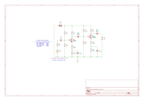
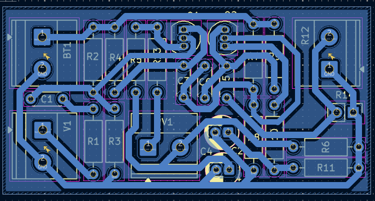
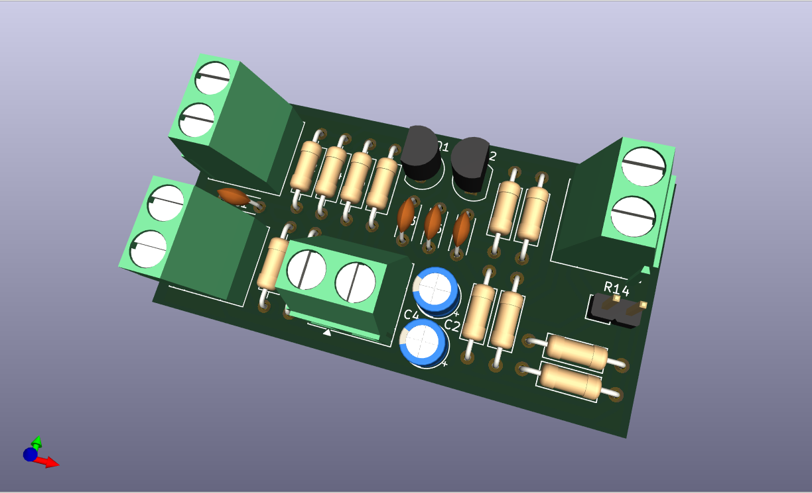

# Multi-Stage BJT Power Amplifier (v1.0)

A high-gain, dual-stage BJT amplifier project designed for the **Stage I (Feb 26)** milestone. This design is optimized for fabrication on a **presensitized PCB** with a compact footprint.

### Design Specifications
* **Target Gain ($A_v$):** $\ge 120$
* **Frequency Range:** $80\text{Hz}$ to $20\text{kHz}$
* **Board Dimensions:** $2.245 \times 1.100$ inches
* **Trace Clearance:** $0.200\text{mm}$ ~ $0.400\text{mm}$ 
* **Track Width:** $1.0\text{mm}$
* **Fabrication Method:** Presensitized PCB

### Component Notes
* **Coupling Capacitors:** 10µF 50V **Monolithic Ceramics** (Code 106).
* **Bypass Capacitors:** 30µF/33µF **16V** Electrolytics.
* **Note:** Monolithic capacitors are utilized in this design as the primary representation for high-value ceramic components to ensure a compact and stable PCB layout.

### Components (Table of Expense)

| Category | Component Description | Qty | Unit Price (PHP) | Total (PHP) |
| :--- | :--- | :---: | :---: | :---: |
| **Active** | BC547A NPN Transistor (Stage 1) | 1 | ₱2.00 | ₱2.00 |
| **Active** | 2N3904 NPN Transistor (Stage 2) | 1 | ₱2.00 | ₱2.00 |
| **Capacitors** | 10µF 50V Monolithic Ceramic (106) | 3 | ₱2.00 | ₱6.00 |
| **Capacitors** | 30µF/33µF 16V Electrolytic | 2 | ₱2.50 | ₱5.00 |
| **Resistors** | 1/4W Metal Film Resistors | 11 | ₱0.50 | ₱5.50 |
| **Connectors** | 2-Pin Screw Terminal (5.08mm) | 3 | ₱15.00 | ₱45.00 |
| **Fabrication**| **Presensitized PCB (4x6 inches)** | 1 | **₱200.00** | **₱200.00** |
| **TOTAL** | | | | **₱265.50** |

*Note: Fabrication cost based on local retail pricing (e.g., Deeco).*

### Design Documentation

#### Schematic Diagram

### PCB Layout & 3D Preview
| 2D Copper Trace View | 3D Rendered View |
| :--- | :--- |
|  |  |

### Repository Structure
* **`/Plot`**: Contains exported manufacturing files (SVG/PNG).